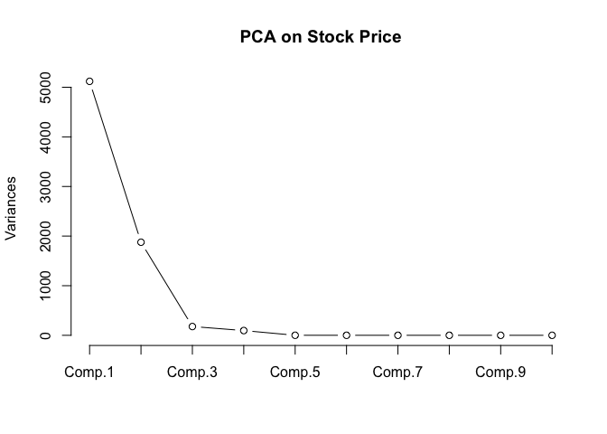

1 - Objective
-------------

LandOcean Energy Services Co., Ltd. (hereafter referred to simply as LandOcean) is a China-based company involved in providing various oil and gas solutions. We are examining the impact of several financial indicators such as rate of return on assets and sales margin, on LandOcean's stock price.

As there are several variables to handle, we will be implementing Principal Component Cnalysis (PCA) to reduce the dimensionality of the dataset and create new uncorrelated variables, so as to ensure an easier process of building the model.

2 - Implementation
------------------

### Importing Stock Price Dataset

    stock = read.csv('stkpc_analysis.csv')

### Principal Component Analysis

    stock_pca = princomp(stock[, -1])
    summary(stock_pca)

    ## Importance of components:
    ##                            Comp.1     Comp.2      Comp.3     Comp.4
    ## Standard deviation     71.5496724 43.3166216 13.30986041 9.77728286
    ## Proportion of Variance  0.7041911  0.2580978  0.02436813 0.01314957
    ## Cumulative Proportion   0.7041911  0.9622889  0.98665707 0.99980664
    ##                              Comp.5       Comp.6       Comp.7       Comp.8
    ## Standard deviation     8.227371e-01 5.354561e-01 4.331474e-01 3.538709e-01
    ## Proportion of Variance 9.311022e-05 3.943874e-05 2.580754e-05 1.722523e-05
    ## Cumulative Proportion  9.998997e-01 9.999392e-01 9.999650e-01 9.999822e-01
    ##                              Comp.9      Comp.10      Comp.11      Comp.12
    ## Standard deviation     2.990243e-01 1.468785e-01 1.093581e-01 5.244835e-02
    ## Proportion of Variance 1.229952e-05 2.967507e-06 1.645043e-06 3.783894e-07
    ## Cumulative Proportion  9.999945e-01 9.999975e-01 9.999991e-01 9.999995e-01
    ##                             Comp.13      Comp.14      Comp.15      Comp.16
    ## Standard deviation     4.186733e-02 3.886714e-02 1.508148e-02 8.614272e-03
    ## Proportion of Variance 2.411158e-07 2.077976e-07 3.128694e-08 1.020734e-08
    ## Cumulative Proportion  9.999998e-01 1.000000e+00 1.000000e+00 1.000000e+00

    pca2 <- prcomp(stock[,-1])
    summary(pca2)

    ## Importance of components:
    ##                            PC1     PC2      PC3     PC4     PC5     PC6
    ## Standard deviation     71.6624 43.3849 13.33084 9.79269 0.82403 0.53630
    ## Proportion of Variance  0.7042  0.2581  0.02437 0.01315 0.00009 0.00004
    ## Cumulative Proportion   0.7042  0.9623  0.98666 0.99981 0.99990 0.99994
    ##                            PC7     PC8     PC9   PC10   PC11    PC12
    ## Standard deviation     0.43383 0.35443 0.29950 0.1471 0.1095 0.05253
    ## Proportion of Variance 0.00003 0.00002 0.00001 0.0000 0.0000 0.00000
    ## Cumulative Proportion  0.99996 0.99998 0.99999 1.0000 1.0000 1.00000
    ##                           PC13    PC14    PC15     PC16
    ## Standard deviation     0.04193 0.03893 0.01511 0.008628
    ## Proportion of Variance 0.00000 0.00000 0.00000 0.000000
    ## Cumulative Proportion  1.00000 1.00000 1.00000 1.000000

We can determine from the summary that the first 2 principal components
(PCs) are sufficient to explain the variance in the variables - 96% to
be precise.

Let us visualize this discovery using a scree plot below.

### Scree Plot

    screeplot(stock_pca, type = 'line',
              main = 'PCA on Stock Price')

As it can be clearly seen in the scree plot, the first 2 PCs explain
most of the variability as there is a sharp kink at PC3 when the line
begins to straighten on the chart.

### Biplot with *ggbiplot* package

    library(ggbiplot)
    s = ggbiplot(stock_pca, obs.scale = 1, var.scale = 1, 
                 ellipse = T, circle = T)
    print(s + coord_cartesian(xlim = c(-200, 200), ylim = c(-200, 200)))

### Train-Test Split with *caTools* package

    # install.packages('caTools')
    library(caTools)
    set.seed(123)
    #split = sample.split(stock$`stock price `, SplitRatio = 0.8)
    #trainset = subset(stock, split == T)
    #testset = subset(stock, split == F)

### Applying PCA with *caret* package

    # install.packages('caret')
    library(caret)
    #trans = preProcess(trainset[-1], method = c('scale', 'pca'), pcaComp = 2)
    #trainset = predict(trans, trainset)
    #testset = predict(trans, testset)

Generate report
