1 - Objective
-------------
<<<<<<< HEAD

This is a PCA analysis of stock prices in various Chinese stock
markets... (to be elaborated)
=======
This is a PCA analysis of stock prices in various Chinese stock markets... (to be elaborated)
>>>>>>> 511bb2062d2a4261a225f1a24fded04a80de90bb

2 - Implementation
------------------

### Importing Stock Price Dataset

    stock = read.csv('stkpc_analysis.csv')
    head(stock)

    ##   stock.price rate.of.return.on.total.assets_ROA_A net.assets.income.rateA
    ## 1       21.61                             0.121386                0.132871
    ## 2       11.56                             0.146654                0.154035
    ## 3       14.70                             0.154913                0.208913
    ## 4       12.75                             0.070378                0.080534
    ## 5        7.11                             0.027733                0.033302
    ## 6       19.80                             0.113251                0.127485
    ##   operating.profit.ratio Sales.Margin.rate turnover.of.account.receivableA
    ## 1               0.290876          0.302877                        1.973517
    ## 2               0.459153          0.397007                        2.378458
    ## 3               0.174533          0.152238                       26.698053
    ## 4               0.122215          0.195572                        2.311944
    ## 5               0.080283          0.067811                        2.630343
    ## 6               0.223832          0.218812                        5.722892
    ##   rate.of.stock.turnoverA velocity.of.liquid.assetsA
    ## 1                4.704993                   0.628905
    ## 2                1.403312                   0.544518
    ## 3                3.314591                   1.361672
    ## 4                1.824801                   0.603102
    ## 5                3.510590                   0.607223
    ## 6                3.772615                   0.881164
    ##   turnover.of.total.capitalA liquidity.ratio quick.ratio
    ## 1                   0.400777        7.907656    7.535940
    ## 2                   0.369400       15.521238   14.264261
    ## 3                   1.017569        2.891113    2.308431
    ## 4                   0.359856        4.855210    4.095397
    ## 5                   0.408977        4.124295    3.634091
    ## 6                   0.517572        5.362788    5.021824
    ##   asset.liability.ratio equity.multiplier Total.Assets.Growth.RateA
    ## 1              0.086434          1.094612                  0.074916
    ## 2              0.047916          1.050327                  0.125825
    ## 3              0.258480          1.348580                  0.285072
    ## 4              0.126114          1.144313                  0.055495
    ## 5              0.167224          1.200803                 -0.028447
    ## 6              0.111658          1.125693                  0.081640
    ##   net.profit.growth.rateA increase.rate.of.business.revenue
    ## 1                0.735358                          0.404529
    ## 2               -0.135686                          0.079896
    ## 3                2.945090                          0.968384
    ## 4                0.057540                          0.225008
    ## 5              -14.120561                          0.219988
    ## 6               -0.026540                          0.145946
    ##   sustainable.growth.rate
    ## 1                0.093065
    ## 2                0.108911
    ## 3                0.167203
    ## 4                0.076830
    ## 5                0.001099
    ## 6                0.050509

### Principal Component Analysis

    #stock_pca = princomp(stock[, -1])
    #summary(stock_pca)

    pca <- prcomp(stock[2:17],center = TRUE, scale. =TRUE)
    pca2 <-  prcomp(stock[2:17]) #without scaling
    summary(pca)

    ## Importance of components:
    ##                           PC1    PC2    PC3     PC4     PC5     PC6
    ## Standard deviation     2.1526 1.8636 1.2870 1.12791 1.07534 1.00220
    ## Proportion of Variance 0.2896 0.2171 0.1035 0.07951 0.07227 0.06277
    ## Cumulative Proportion  0.2896 0.5067 0.6102 0.68971 0.76198 0.82476
    ##                            PC7     PC8     PC9    PC10    PC11    PC12
    ## Standard deviation     0.93517 0.83553 0.76182 0.58420 0.37911 0.25505
    ## Proportion of Variance 0.05466 0.04363 0.03627 0.02133 0.00898 0.00407
    ## Cumulative Proportion  0.87941 0.92305 0.95932 0.98065 0.98963 0.99370
    ##                           PC13    PC14    PC15    PC16
    ## Standard deviation     0.22086 0.17649 0.13389 0.05467
    ## Proportion of Variance 0.00305 0.00195 0.00112 0.00019
    ## Cumulative Proportion  0.99675 0.99869 0.99981 1.00000

    print(pca)

    ## Standard deviations:
    ##  [1] 2.15261434 1.86361078 1.28698920 1.12791404 1.07534136 1.00219683
    ##  [7] 0.93516720 0.83552939 0.76181748 0.58419554 0.37911364 0.25504843
    ## [13] 0.22085861 0.17649334 0.13388870 0.05466919
    ## 
    ## Rotation:
    ##                                              PC1          PC2          PC3
    ## rate.of.return.on.total.assets_ROA_A -0.44224402  0.073868053 -0.043174643
    ## net.assets.income.rateA              -0.43565462  0.149695050  0.002659954
    ## operating.profit.ratio               -0.41838654  0.011077526  0.035680902
    ## Sales.Margin.rate                    -0.42846830 -0.002899346  0.065164067
    ## turnover.of.account.receivableA      -0.01160320  0.122693913 -0.418485716
    ## rate.of.stock.turnoverA              -0.04008024  0.004083312 -0.050944985
    ## velocity.of.liquid.assetsA            0.01283187  0.358002946 -0.485599640
    ## turnover.of.total.capitalA           -0.01206318  0.352915222 -0.493149821
    ## liquidity.ratio                      -0.09623227 -0.380577724 -0.257872626
    ## quick.ratio                          -0.09877442 -0.379858199 -0.251907833
    ## asset.liability.ratio                 0.17587925  0.405077262  0.157893080
    ## equity.multiplier                     0.15531869  0.372018976  0.122986624
    ## Total.Assets.Growth.RateA            -0.07761889  0.275792499  0.282515485
    ## net.profit.growth.rateA              -0.02705228  0.009669171  0.117144018
    ## increase.rate.of.business.revenue    -0.13920350  0.044294057  0.265758804
    ## sustainable.growth.rate              -0.39208811  0.185697955  0.041263870
    ##                                               PC4         PC5
    ## rate.of.return.on.total.assets_ROA_A  0.068188737 -0.02905737
    ## net.assets.income.rateA              -0.015013679 -0.00753518
    ## operating.profit.ratio               -0.026999228 -0.20332443
    ## Sales.Margin.rate                    -0.044307740 -0.11687588
    ## turnover.of.account.receivableA      -0.008441741  0.13114553
    ## rate.of.stock.turnoverA               0.031405405 -0.30150326
    ## velocity.of.liquid.assetsA            0.054997487  0.05790117
    ## turnover.of.total.capitalA            0.066551697  0.12887644
    ## liquidity.ratio                      -0.492223595  0.14240290
    ## quick.ratio                          -0.497250914  0.13982949
    ## asset.liability.ratio                -0.364983656 -0.02307701
    ## equity.multiplier                    -0.448870363 -0.02581236
    ## Total.Assets.Growth.RateA            -0.373312779  0.01610454
    ## net.profit.growth.rateA               0.117835361  0.72516808
    ## increase.rate.of.business.revenue     0.069246183  0.49018714
    ## sustainable.growth.rate              -0.040478267  0.09269209
    ##                                                PC6         PC7
    ## rate.of.return.on.total.assets_ROA_A  0.0611107801 -0.10640886
    ## net.assets.income.rateA               0.0568129272 -0.08008401
    ## operating.profit.ratio                0.0056663012  0.10788521
    ## Sales.Margin.rate                    -0.0054873697  0.04425377
    ## turnover.of.account.receivableA      -0.3226459373  0.63177769
    ## rate.of.stock.turnoverA              -0.8875467123 -0.23903170
    ## velocity.of.liquid.assetsA            0.0793331553 -0.11919148
    ## turnover.of.total.capitalA            0.1029154149 -0.12331533
    ## liquidity.ratio                       0.0003684995 -0.05787465
    ## quick.ratio                          -0.0111023202 -0.05443203
    ## asset.liability.ratio                -0.0209210029 -0.04543759
    ## equity.multiplier                    -0.0204698080 -0.06714192
    ## Total.Assets.Growth.RateA            -0.0739224460  0.13490381
    ## net.profit.growth.rateA              -0.2370678050 -0.44526908
    ## increase.rate.of.business.revenue    -0.1428725728  0.48488875
    ## sustainable.growth.rate               0.0345297431 -0.13604402
    ##                                               PC8          PC9
    ## rate.of.return.on.total.assets_ROA_A  0.013238171 -0.052477922
    ## net.assets.income.rateA              -0.031542516 -0.003853726
    ## operating.profit.ratio                0.100447467  0.232266574
    ## Sales.Margin.rate                     0.165662149  0.248373225
    ## turnover.of.account.receivableA       0.483158323  0.087846903
    ## rate.of.stock.turnoverA              -0.237868521 -0.043571055
    ## velocity.of.liquid.assetsA           -0.158895648 -0.148714308
    ## turnover.of.total.capitalA           -0.246648374 -0.040999515
    ## liquidity.ratio                      -0.103321855 -0.016083346
    ## quick.ratio                          -0.099180688 -0.013374941
    ## asset.liability.ratio                 0.009547949  0.277643401
    ## equity.multiplier                    -0.017170816  0.408139101
    ## Total.Assets.Growth.RateA             0.170105804 -0.766558077
    ## net.profit.growth.rateA               0.385782903  0.082741331
    ## increase.rate.of.business.revenue    -0.619849608  0.085394502
    ## sustainable.growth.rate              -0.048097287 -0.048282444
    ##                                               PC10         PC11
    ## rate.of.return.on.total.assets_ROA_A  0.2154127359 -0.064677162
    ## net.assets.income.rateA               0.2101199381 -0.028769563
    ## operating.profit.ratio               -0.4634231860 -0.090088410
    ## Sales.Margin.rate                    -0.3721107771 -0.006499780
    ## turnover.of.account.receivableA       0.2154488914  0.020711162
    ## rate.of.stock.turnoverA               0.0065277022 -0.014340430
    ## velocity.of.liquid.assetsA           -0.3697622802  0.641373704
    ## turnover.of.total.capitalA           -0.0506459839 -0.687144201
    ## liquidity.ratio                      -0.0029333815  0.027869909
    ## quick.ratio                          -0.0007036395  0.002570466
    ## asset.liability.ratio                 0.0496292985  0.082148892
    ## equity.multiplier                     0.0519176942 -0.051523858
    ## Total.Assets.Growth.RateA            -0.1956097315 -0.123980927
    ## net.profit.growth.rateA              -0.1688518388 -0.030812258
    ## increase.rate.of.business.revenue    -0.1007815601  0.037626732
    ## sustainable.growth.rate               0.5370017154  0.273397334
    ##                                              PC12         PC13
    ## rate.of.return.on.total.assets_ROA_A  0.635410276  0.120478457
    ## net.assets.income.rateA               0.217020490  0.247643935
    ## operating.profit.ratio               -0.068268957 -0.030453768
    ## Sales.Margin.rate                    -0.270273199 -0.045871647
    ## turnover.of.account.receivableA       0.029578263  0.007699905
    ## rate.of.stock.turnoverA              -0.006514900  0.004930651
    ## velocity.of.liquid.assetsA            0.107120965 -0.033758040
    ## turnover.of.total.capitalA           -0.211078200 -0.009601974
    ## liquidity.ratio                      -0.009986703  0.031331071
    ## quick.ratio                           0.003147158  0.060628996
    ## asset.liability.ratio                -0.151678227  0.708043836
    ## equity.multiplier                     0.303440000 -0.585460717
    ## Total.Assets.Growth.RateA            -0.008829424 -0.064676701
    ## net.profit.growth.rateA               0.029325393  0.008604606
    ## increase.rate.of.business.revenue     0.049773504  0.009210710
    ## sustainable.growth.rate              -0.543961685 -0.258303295
    ##                                              PC14         PC15
    ## rate.of.return.on.total.assets_ROA_A -0.207862646  0.510440305
    ## net.assets.income.rateA               0.169975517 -0.770801081
    ## operating.profit.ratio                0.655401884  0.218117691
    ## Sales.Margin.rate                    -0.691637868 -0.114230198
    ## turnover.of.account.receivableA       0.009620330 -0.011022674
    ## rate.of.stock.turnoverA              -0.011949509 -0.005774755
    ## velocity.of.liquid.assetsA           -0.011551844 -0.023103146
    ## turnover.of.total.capitalA           -0.038955691  0.042306806
    ## liquidity.ratio                       0.033550027 -0.007995366
    ## quick.ratio                          -0.014141600  0.034330425
    ## asset.liability.ratio                -0.013632798  0.180231281
    ## equity.multiplier                    -0.007302468 -0.089972506
    ## Total.Assets.Growth.RateA            -0.017478632  0.007003499
    ## net.profit.growth.rateA               0.071800435  0.002769287
    ## increase.rate.of.business.revenue    -0.032397847  0.026965094
    ## sustainable.growth.rate               0.100126657  0.199020981
    ##                                               PC16
    ## rate.of.return.on.total.assets_ROA_A -0.0318725332
    ## net.assets.income.rateA               0.0206583244
    ## operating.profit.ratio                0.0136487505
    ## Sales.Margin.rate                    -0.0185291086
    ## turnover.of.account.receivableA      -0.0036020410
    ## rate.of.stock.turnoverA              -0.0066819873
    ## velocity.of.liquid.assetsA            0.0159607367
    ## turnover.of.total.capitalA           -0.0083604099
    ## liquidity.ratio                      -0.7067524860
    ## quick.ratio                           0.7053437446
    ## asset.liability.ratio                -0.0202666990
    ## equity.multiplier                     0.0079602403
    ## Total.Assets.Growth.RateA            -0.0040199310
    ## net.profit.growth.rateA               0.0006675884
    ## increase.rate.of.business.revenue    -0.0026678458
    ## sustainable.growth.rate               0.0117809962

We can determine from the summary that the first 4 principal components
(PCs) are sufficient to explain the variance in the variables - 99% to
be precise.

Let us visualize this discovery using a scree plot below.

### Scree Plot

    screeplot(pca, type = 'l',
              main = 'PCA on Stock Price')

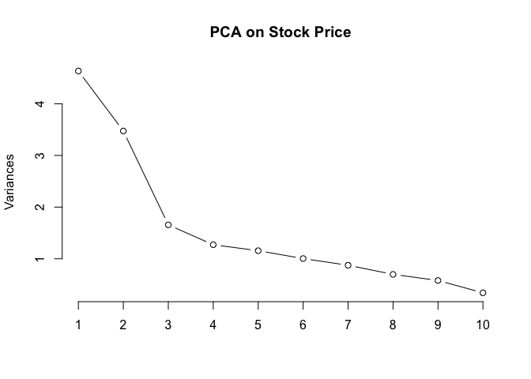

As it can be clearly seen in the scree plot, the first 2 PCs explain
most of the variability as there is a sharp kink at PC3 when the line
begins to straighten on the chart.

### Biplot with *ggbiplot* package

    library(ggbiplot)
    s = ggbiplot(pca2, obs.scale = 1, var.scale = 1, 
                 ellipse = T, circle = T)
    print(s + coord_cartesian(xlim = c(-200, 200), ylim = c(-200, 200)))

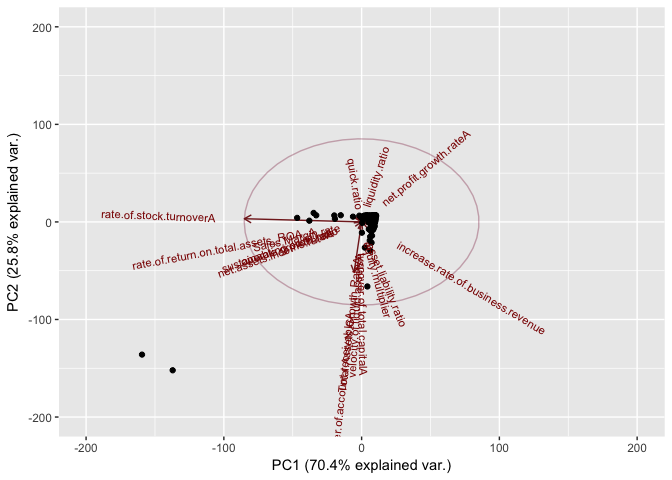

### clustering

    library(devtools)
    #install_github("ggbiplot", "vqv")
     
    stock_price <- stock[,1]

    stock_category <- lapply(stock_price, function(price){
      if(price <= 20){
        return("LOW")
      }else if(price > 20 &  price <= 40 ){
        return ("NORMAL")
      }else if(price > 40  &  price <= 55 ){
        return ("HIGH")
      }else if( price > 55 ){
        return ("V.HIGH")
      }else {
        print("some garbage")
        print(price)
        return(NA)
      }
    })

    stock_category <- as.factor(unlist(stock_category))

    hist(stock_price)

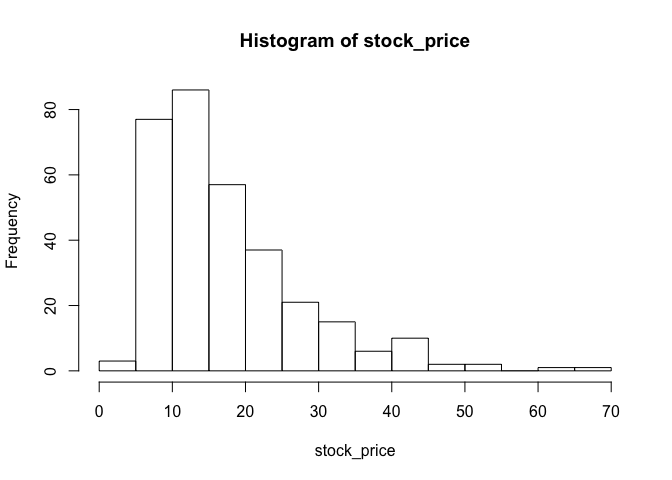

    library(ggbiplot)
    g <- ggbiplot(pca, obs.scale = 1, var.scale = 1, 
                  groups = stock_category, ellipse = TRUE, 
                  circle = TRUE)

    g <- g + scale_color_discrete(name = '')
    g <- g + theme(legend.direction = 'horizontal', 
                   legend.position = 'top')
    print(g)

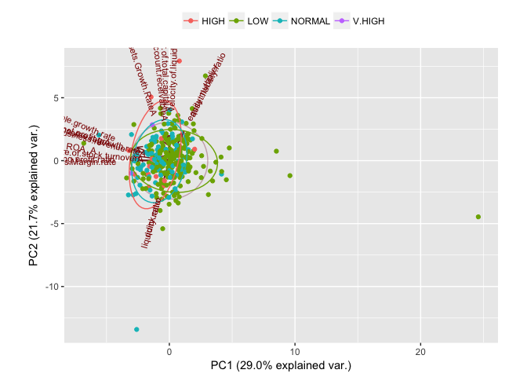 \#\#\#
biplot

    biplot(pca, scale = TRUE, expand = 2)

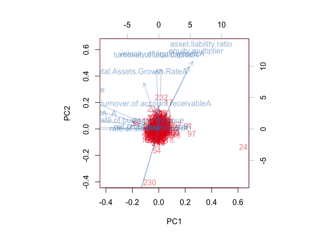

#### Selecting Princial Components

    ev <- pca$sdev^2

    print(ev)

    ##  [1] 4.63374849 3.47304513 1.65634120 1.27219009 1.15635905 1.00439849
    ##  [7] 0.87453769 0.69810936 0.58036587 0.34128443 0.14372716 0.06504970
    ## [13] 0.04877853 0.03114990 0.01792618 0.00298872

Here, till 6 components , eigen values are &gt;1, so will discard
others.

### Regression Analysis with PCA components

    # install.packages('caTools')
    stock.re <- data.frame(pca$x)
    fit1<- lm(stock_price ~ stock.re$PC1 + stock.re$PC2 + stock.re$PC3 + stock.re$PC4 + stock.re$PC5 + stock.re$PC6, data=stock.re)
    summary(fit1)

    ## 
    ## Call:
    ## lm(formula = stock_price ~ stock.re$PC1 + stock.re$PC2 + stock.re$PC3 + 
    ##     stock.re$PC4 + stock.re$PC5 + stock.re$PC6, data = stock.re)
    ## 
    ## Residuals:
    ##     Min      1Q  Median      3Q     Max 
    ## -18.839  -6.766  -2.134   4.499  49.698 
    ## 
    ## Coefficients:
    ##              Estimate Std. Error t value Pr(>|t|)    
    ## (Intercept)   17.4862     0.5298  33.005  < 2e-16 ***
    ## stock.re$PC1  -1.5872     0.2465  -6.439 4.57e-10 ***
    ## stock.re$PC2   0.3690     0.2847   1.296  0.19592    
    ## stock.re$PC3   0.1370     0.4123   0.332  0.73983    
    ## stock.re$PC4  -0.6799     0.4705  -1.445  0.14939    
    ## stock.re$PC5   0.5311     0.4935   1.076  0.28268    
    ## stock.re$PC6  -1.4644     0.5295  -2.766  0.00602 ** 
    ## ---
    ## Signif. codes:  0 '***' 0.001 '**' 0.01 '*' 0.05 '.' 0.1 ' ' 1
    ## 
    ## Residual standard error: 9.448 on 311 degrees of freedom
    ## Multiple R-squared:  0.1483, Adjusted R-squared:  0.1318 
    ## F-statistic: 9.024 on 6 and 311 DF,  p-value: 4.228e-09

Lets visualize it

    plot(fit1)

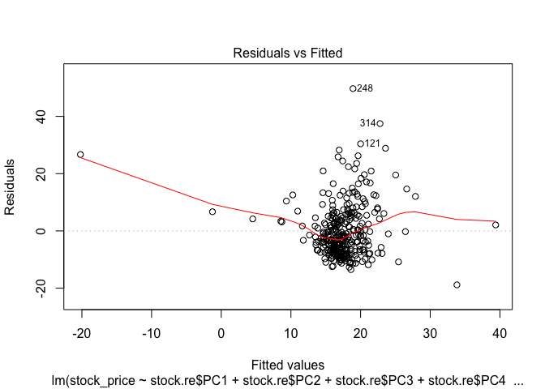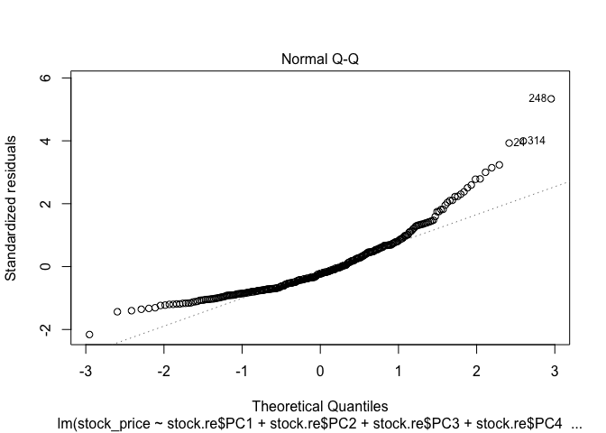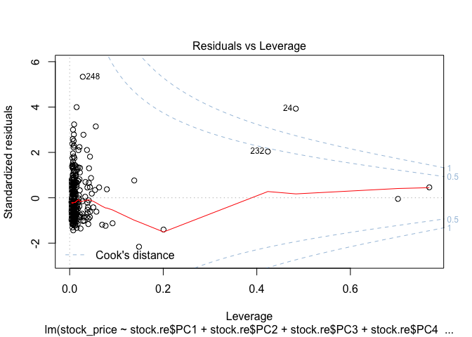

### Cluster Analysis foe components

#### Analysing the components (taking 6 PC)

    plot(stock.re[1:6], pch=16, col=rgb(0,0,0,0.5))

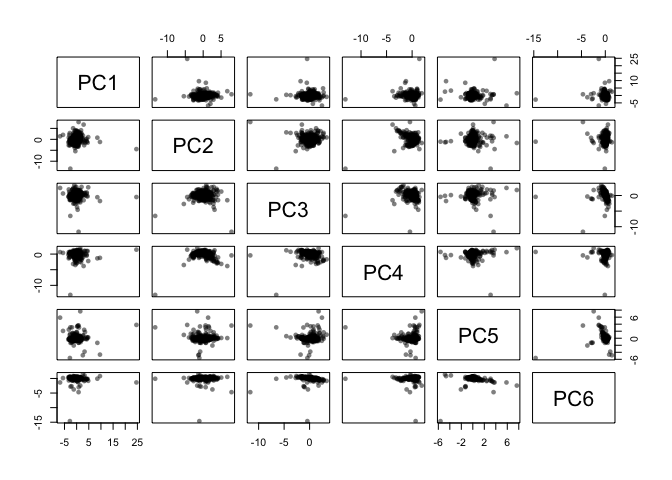

Here are twelve 2-D projections of data which are in a 6-D space. You
can see there’s a clear outlier in all the dimensions, as well as some
bunching together in the different projections.

Lets visualize in 3d space

    library(rgl)
    # Multi 3D plot
    comp <- stock.re[1:6]
    plot3d(comp$PC1, comp$PC2, comp$PC3)
    plot3d(comp$PC4, comp$PC5, comp$PC6)
    plot3d(comp$PC1, comp$PC3, comp$PC4)

#### K-mean Clustering

    # Determine number of clusters
    wss <- (nrow(stock)-1)*sum(apply(stock,2,var))
    for (i in 2:16) wss[i] <- sum(kmeans(stock,centers=i)$withinss)
    plot(1:16, wss, type="b", xlab="Number of Clusters",ylab="Within groups sum of squares")

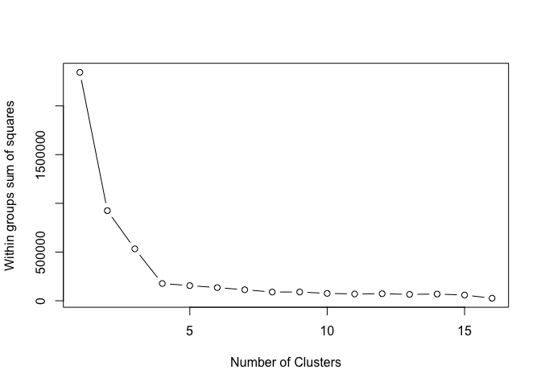 So here
we can see that the “elbow” in the scree plot is at k=5, so we apply the
k-means clustering function with k = 5 and plot.

    # Apply k-means with k=4
    k <- kmeans(comp, 5, nstart=25, iter.max=1000)
    library(RColorBrewer)
    library(scales)
    palette(alpha(brewer.pal(9,'Set1'), 0.5))
    plot(comp, col=k$clust, pch=16)

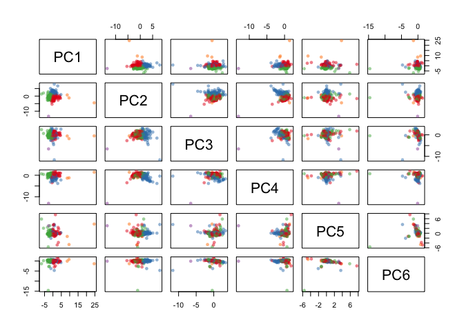 Here,
few outliers, with 2 ans 3. Lets visualize with 3d plot

    plot3d(comp$PC1, comp$PC2, comp$PC3, col=k$clust)
    plot3d(comp$PC4, comp$PC5, comp$PC6, col=k$clust)

#### Naming the clusters

    #Sorting based on cluster sizes
    sort(table(k$clust))

    ## 
    ##   4   5   2   3   1 
    ##   1   3  75 105 134

    clust <- names(sort(table(k$clust)))

    print(clust)

    ## [1] "4" "5" "2" "3" "1"

Generate report rmarkdown::render( input="stock.Rmd",
output\_format="md\_document", output\_file="README.md" )
