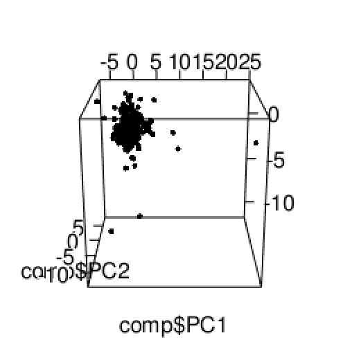
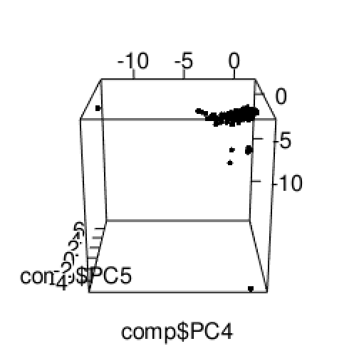
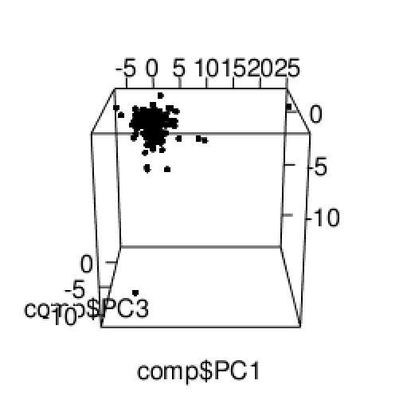
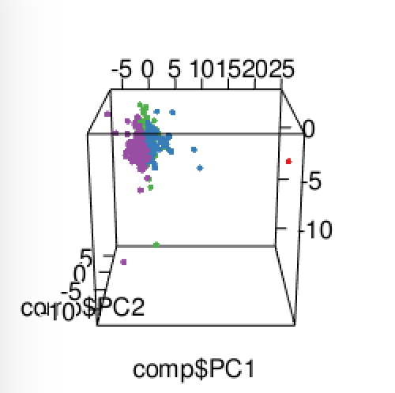
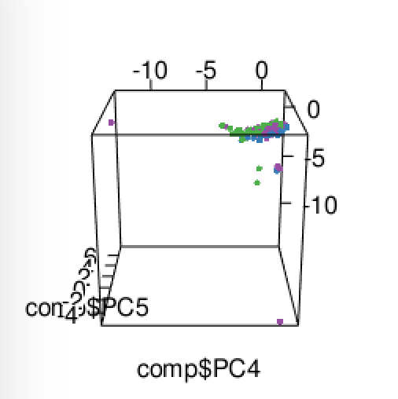

1 - Objective
----------------

This is an analysis of the stock prices of 300 high-tech companies based in China, using 16 financial indicators as independent variables. In order to reduce the dimensionality of the dataset, we will be performing Principal Component Analysis (PCA) on the data. After which, we will attempt to fit a regression to the data and conduct K-means clustering on the sample.

2 - Implementation - PCA
----------------

### Importing Stock Price Dataset
```{r}
stock = read.csv('stkpc_analysis1.csv',header=T, sep=",", row.names=1)
stock2 = read.csv('stkpc_analysis1.csv')
```
### Principal Component Analysis (PCA)
```{r}

pca <- prcomp(stock[2:17], center = TRUE, scale. =TRUE)
pca2 <-  prcomp(stock2[3:18], center = TRUE, scale. =TRUE) #without scaling
summary(pca)

print(pca)
```

We have created 2 PCA objects, one with scaling and the other without, as a backup.

Let us visualize this discovery using a scree plot below.

### Scree Plot 
```{r}
screeplot(pca, type = 'l',
          main = 'PCA on Stock Price')
```

It may not be immediately clear which PCs we should select as the kink in the scree plot at PC3 may not be sufficient to explain the variability of the diagram. 

We will take a look at their eigenvalues to decide which PCs should be selected.

#### Selecting Principal Components
```{r}
ev <- pca$sdev^2
print(ev)
```


The first 6 PCs have eigenvalues above 1, thus we will discard the rest. Cumulatively, the 6 PCs explain 82.5% of the variance in the data, which should be sufficient for our needs.

The first 4 PCs seem to be relatively strongly correlated (about -0.40) to various financial indicators tied to company assets, such as rate of return on total assets and liquidity ratio. These correlations are considered strong as compared to the other variables, which have correlations even lower than -/+ 0.40. This would suggest that these 4 PCs would increase with decreasing asset-based financial ratios.

PC5 is very highly correlated with net profit growth rate, which indicates that this PC is very likely to rise the quicker the company's net profit grows. The 6th and last PC is negatively correlated with the rate of stock turnover, which suggests that the slower that stock is sold or used the higher PC6 increases. However, this is not surprising in the high-tech industry as capital equipment is not frequently replaced or sold.


### Visualization of Orthogonal Variables
```{r}
biplot(pca2, scale = TRUE, expand = 2)
```

We visualize the orthogonal variables for the first 2 PCs, using the above biplot.

3 - Implementation - Regression
----------------

### Regression Analysis with PCA components
```{r}
# install.packages('caTools')
stock.re <- data.frame(pca$x)
stock.re$stock_price = stock$stock.price
fit1<- lm(stock_price ~ stock.re$PC1 + stock.re$PC2 + stock.re$PC3 + stock.re$PC4 + stock.re$PC5 + stock.re$PC6, data=stock.re)
summary(fit1)
```

From the summary of the regression fit, we can tell that PC1 and PC6 are significant in the fit. However, the overall model is not a good fit as told by the adjust R-squared indicator of 13.2%.

```{r}
par(mfrow = c(2, 2))
plot(fit1)
```
From the diagnostic plots, we can see that the model does not follow that of a linear regression. There is a visible curve in the Normal Q-Q plots, thus it does not adhere to the dotted straight line. In the Scale-Location plot, we do not see a straight red line and points which are very closely positioned together.

Thus a linear regression model is not strong enough to predict the results of this model. There are also a couple of outlier in the dataset, identified in the Residuals vs Leverage plot which can drastically affect the overall analysis when removed.


### Cluster Analysis of PCs

#### Analysing the Components (taking 6 PCs)
```{r} 
plot(stock.re[1:6], pch=16, col=rgb(0,0,0,0.5))
```

Here are twelve 2-D projections of data which are in a 6-D space. You can see there’s a clear outlier in all the dimensions, as well as some bunching together in the different projections.

Let us visualize in a 3-D space below.
 
```{r}
# install.packages('rgl')
library(rgl)
# Multi 3D plot
comp <- stock.re[1:6]
plot3d(comp$PC1, comp$PC2, comp$PC3)
plot3d(comp$PC4, comp$PC5, comp$PC6)
plot3d(comp$PC1, comp$PC3, comp$PC4)
```

{ width=50% }

Comparing PC1, PC2, PC3

{ width=50% }

Comparing PC4, PC5, PC6

{ width=50% }

Comparing PC1, PC3 and PC4

#### K-mean Clustering

```{r}
# Reset Within-Cluster Sum of Squares
wcss = vector()
# Determine number of clusters
for (i in 1:10) wcss[i] = sum(kmeans(stock[2:17], i)$withinss)
plot(1:10, wcss, type = 'b', 
     main = paste('Clusters of Companies'), 
     xlab = 'Number of clusters',
     ylab = 'WCSS')
```

So here we can see that the “elbow” in the scree plot is at k = 4, so we apply the k-means clustering function with k = 4 and plot.

```{r}
# Apply k-means with k=4
comp = stock.re[1:6]
k <- kmeans(comp, 4, nstart=25, iter.max=1000)
library(RColorBrewer)
library(scales)
palette(alpha(brewer.pal(9,'Set1'), 0.5))
plot(comp[1:6], col=k$clust, pch=16)
```

Here, few outliers, with 2 and 3. Lets visualize with 3d plot

```{r}
plot3d(comp$PC1, comp$PC2, comp$PC3, col=k$clust)
plot3d(comp$PC4, comp$PC5, comp$PC6, col=k$clust)
```
{ width:100px; }


Comparing PC1, PC2 and PC3 with K-mean clustering

{ width=50% }

Comparing PC4, PC5 and PC6 with K-mean clustering

#### Naming the clusters

```{r}
#Sorting based on cluster sizes
table(k$clust)
clust <- names(sort(table(k$clust)))
clust
head(k$clust)

hist(k$clust)

```


We Can Categorize different Clusters as

1. Enery Companies -  109 companies
2. Techonology Companies - 128 companies
3. PhotoElectric Companies - 1 Company
4. Raw Material Companies - 80 Companies


Generate report
rmarkdown::render(
  input="stock.Rmd", 
  output_format="md_document", 
  output_file="README.md"
) 

